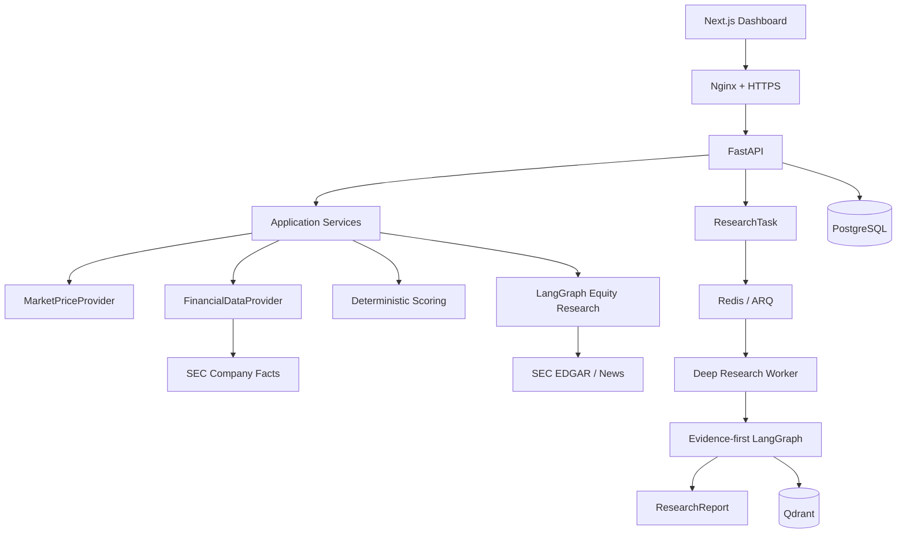
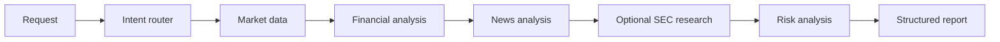
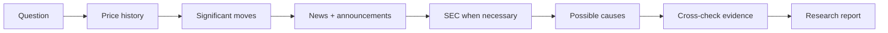

# AI Equity Research Agent

An evidence-first US equity research workspace built as a portfolio project for
AI Agent Engineer and Forward Deployed Engineer roles. The system separates
data acquisition, deterministic financial scoring, citation-aware retrieval,
agent orchestration, background research, and the presentation layer.

## Why this project

Most research demos hide the path from a number to a conclusion. This project
keeps that path inspectable:

- market prices, fundamentals, news, and SEC filings use separate provider
  interfaces;
- core scores are deterministic Python calculations, not LLM decisions;
- every score component preserves its raw value, normalized score, weight,
  contribution, and source;
- SEC answers use filing identity and chunk identity instead of fragile PDF page
  numbers;
- long-running questions cross an HTTP 202 task boundary and a worker-ready
  LangGraph workflow.

## Delivered scope

| Phase | Delivered capability |
| --- | --- |
| 1 | FastAPI foundation, config, request IDs, structured logs, errors, health, tests |
| 2 | Market price provider interface, mock mode, Alpha Vantage adapter, stock API |
| 3 | SEC Company Facts fundamentals and explainable deterministic scoring |
| 4 | LangGraph equity research workflow and structured report output |
| 5 | PostgreSQL models, Alembic migration, async repositories |
| 6 | SEC EDGAR adapter, chunking, embeddings, vector-store boundary, citation-aware ask |
| 7 | Evidence-first Deep Research graph, task queue abstraction, ARQ entry point |
| 8 | Next.js research dashboard, stock, compare, SEC Ask, and Deep Research views |
| 9 | Linux VPS Docker Compose, Nginx routing, worker, backup and deployment scripts |
| 10 | QA, documentation, demo script, interview preparation, and release review |

## Architecture



### Agent workflow



### Deep Research workflow



## API

| Method | Endpoint | Purpose |
| --- | --- | --- |
| GET | `/health` | Service and data-mode health |
| GET | `/api/stocks/{ticker}` | Quote and historical price overview |
| POST | `/api/research` | Run the structured LangGraph research workflow |
| GET | `/api/research/{ticker}` | Run the workflow for a ticker from the dashboard |
| POST | `/api/sec/ask` | Citation-aware SEC question answering |
| POST | `/api/deep-research` | Queue a long-running research task; returns HTTP 202 |
| GET | `/api/deep-research/{task_id}` | Poll task status and completed report |

Every successful response includes a top-level `request_id`. Every handled
error uses `ErrorResponse`, and request logs include request ID, method, path,
status code, and latency in milliseconds.

## Local development

The current development environment is native Windows Python. Docker is not
required for local development, and `DATA_MODE=mock` starts without provider
keys or external services.

```powershell
py -3.12 -m venv .venv
.venv\Scripts\python.exe -m pip install -e ".\backend[dev]"
.venv\Scripts\python.exe -m uvicorn app.main:app --app-dir backend --reload --host 127.0.0.1 --port 8000
```

Useful URLs:

- <http://127.0.0.1:8000/health>
- <http://127.0.0.1:8000/docs>
- <http://127.0.0.1:8000/redoc>
- <http://127.0.0.1:3000> when the frontend is run separately

Example API calls:

```powershell
Invoke-RestMethod http://127.0.0.1:8000/health
Invoke-RestMethod http://127.0.0.1:8000/api/stocks/NVDA
```

## Quality gates

```powershell
.venv\Scripts\python.exe -m pytest -q
.venv\Scripts\ruff.exe check backend\app backend\tests
.venv\Scripts\mypy.exe backend\app
```

Tests use deterministic mock providers and local HTTP transports. Real-provider
tests are explicitly marked integration and are not part of the default test
run. See [docs/5-minute-demo.md](docs/5-minute-demo.md) for a repeatable
product demonstration.

## Production deployment target

The production target is a Linux VPS with Docker Compose, Nginx, and HTTPS.
The stack contains `nginx`, `frontend`, `backend`, `worker`, `postgres`,
`qdrant`, and `redis`; only Nginx publishes public ports. Vercel and Render
are optional alternatives, not the primary architecture.

```bash
cp deploy/.env.production.example .env
docker compose config
docker compose up -d --build
docker compose ps
```

Read [docs/deployment.md](docs/deployment.md) for certificates, backups,
health checks, and operations. Docker build is intentionally a deployment
stage gate, not a local Phase 1-8 dependency.

## Project structure

```text
backend/app/
  agents/          LangGraph equity research workflow
  api/             FastAPI routes
  core/            config, logging, request IDs, errors
  db/              async database/session helpers
  deep_research/   evidence-first background workflow
  models/          PostgreSQL persistence models
  providers/       market, fundamentals, and SEC interfaces/adapters
  rag/             SEC chunking, embeddings, vector-store service
  repositories/    persistence access boundaries
  schemas/         API, financial, research, scoring, and citation contracts
  scoring/         deterministic explainable scoring engine
  workers/         queue abstraction and ARQ deployment entry point
frontend/          Next.js dashboard
docs/              architecture, contracts, RAG, deployment, demo, interviews
deploy/            Linux startup and backup scripts
nginx/             reverse-proxy configuration
```

## Known limitations and roadmap

- Local mock mode is the deterministic demo path; real provider credentials are
  not committed.
- The local task queue is in-memory. The ARQ worker entry point and Compose
  wiring are ready for Linux deployment, while durable task/report integration
  remains an operations follow-up.
- The SEC vector store has an in-memory implementation for tests and a Qdrant
  boundary for deployment; embedding quality and filing ingestion are future
  production tuning work.
- Frontend package validation requires Node.js/npm; the backend is independently
  testable without them.

Next recommended increment: connect a real market provider behind the existing
interface, then add authenticated SEC filing ingestion and durable worker
status updates without changing the public contracts.

## Portfolio material

- [Architecture](docs/architecture.md)
- [Shared contracts](docs/shared-contracts.md)
- [Dependency DAG](docs/dependency-dag.md)
- [SEC RAG design](docs/sec-rag.md)
- [Deep Research design](docs/deep-research.md)
- [Frontend design](docs/frontend.md)
- [Linux deployment](docs/deployment.md)
- [Resume project description](docs/resume-project-description.md)
- [Five-minute demo](docs/5-minute-demo.md)
- [Top 20 interview questions](docs/interview-top-20.md)

## Disclaimer

This project is for educational and research purposes only. It does not
provide financial advice. Generated analysis must be independently verified.
