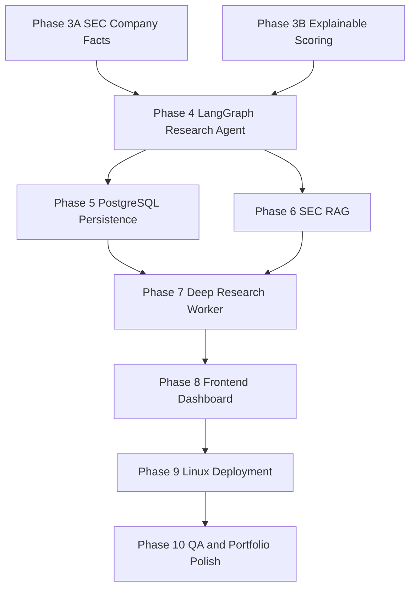

# Phase 3-10 Dependency DAG

## Frozen sequence

Phase 3A and 3B are implemented in parallel after shared contracts are frozen.
Phase 4 consumes both outputs. Phase 5 and Phase 6 may then proceed in
parallel; Phase 7 waits for both persistence and citation contracts.



## Ownership

| Area | Primary owner | Write boundary |
|---|---|---|
| Financial Provider | Agent A | `backend/app/providers/fundamentals/` |
| Scoring | Agent B | `backend/app/scoring/` |
| Research Agent | Agent C | `backend/app/agents/`, `backend/app/tools/` |
| Persistence | Agent D | `backend/app/db/`, `backend/app/models/`, `backend/app/repositories/` |
| SEC RAG | Agent E | `backend/app/rag/`, `backend/app/providers/sec/` |
| Deep Research | Agent F | `backend/app/workers/`, deep-research graph modules |
| Frontend | Agent G | `frontend/` |
| Deployment | Agent H | `docker-compose.yml`, `nginx/`, `deploy/` |
| Architecture review | Agent I | review only unless explicitly assigned |
| QA/adversarial review | Agent J | tests only unless explicitly assigned |

## Commit gates

Each phase ends with focused tests, full tests, lint, type check, diff review and
one commit:

```text
phase3: implement financial data and explainable scoring
phase4: implement langgraph equity research agent
phase5: add postgres persistence
phase6: implement sec filing rag
phase7: implement evidence-based deep research workflow
phase8: build production research dashboard
phase9: add linux production deployment
phase10: final qa and portfolio polish
```
